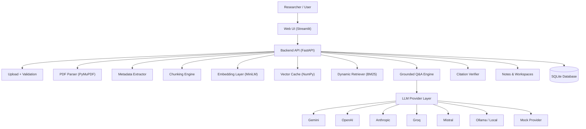
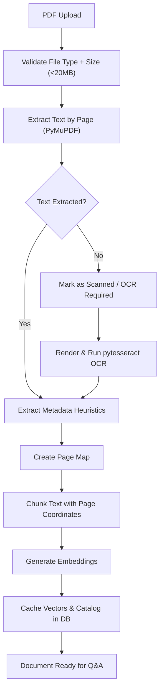
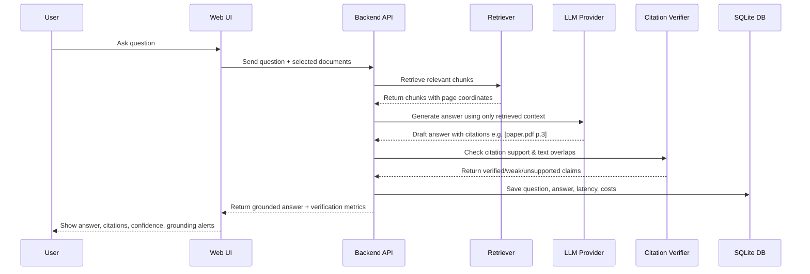

# Research PDF RAG Agent 🔬

> **A citation-grounded AI research assistant for technical and academic PDFs.**

[](https://opensource.org/licenses/MIT)
[](https://fastapi.tiangolo.com/)
[](https://streamlit.io/)
[](#)

---

## 📖 What is the Research PDF RAG Agent?

Generic PDF chat widgets summarize text, but real research workflows require **verifiable grounding**. If an AI assistant cannot support its claims with exact coordinates (source document and page numbers), it is not reliable for scientific or technical analysis.

The **Research PDF RAG Agent** closes this gap. It is a local-first, multi-document research catalog and Q&A engine designed for PhD scholars, engineers, academic labs, legal analysts, and medical teams. It ingests technical papers, reports, manuals, and theses, then answers queries with verified inline citations, checking text overlaps to detect hallucinations.

---

## 🚀 Key Features

- **Dynamic Workspace Isolation**: Group papers into custom projects (e.g. *Thesis Chapter 1*, *Literature Review*). Ask questions and comparison questions restricted to that workspace.
- **Incremental Embedding Cache**: Embeds and chunks papers once on upload and saves caches (`.npy`/`.json`) to disk. Rebuilds and filters indexes dynamically in milliseconds during workspace searches.
- **Blended Hybrid Search**: Blends semantic vector cosine similarity (via HuggingFace sentence-transformers) and lexical BM25 exact term matching:
  $$\text{Score} = 0.62 \times \text{Semantic} + 0.38 \times \text{BM25}$$
- **Verification Layer**: Parses LLM answers for inline citation coordinates, validates them against evidence sources, and calculates sentence-level word overlap (Jaccard Index) to flag unverified claims.
- **Structured Synthesis Tools**: One-click extractions for methodology pipelines, key contributions, stated limitations, research gaps, and reproducibility checklists.
- **Multi-Provider LLM Router**: Run on Gemini (official SDK), OpenAI, Anthropic, Groq, Mistral, Ollama, or custom endpoints.
- **Mock Mode**: Fully functional mock mode that runs without paid keys, simulating structured comparative matrices and grounded answers citing actual document passages.
- **Observability History & Evals**: Logs query latency, costs, and token consumption to SQLite, lets users tag thumbs up/down, and runs automated evaluations against expected scientific terms.
- **Tesseract OCR Pipeline**: Layout-aware PyMuPDF parsing with automated page-by-page OCR fallback for scanned figures, plots, and image-heavy pages.

---

## 🗺️ System Architecture & Workflows

### 1. General Architecture Blueprint


### 2. PDF Ingestion Pipeline


### 3. Citation-Grounded Q&A Flow


---

## 🛠️ Installation & Setup

### Prerequisites
- Python 3.10+
- Tesseract OCR (Optional, required to parse scanned documents)

### 💻 Local Installation
1. **Clone the repository**:
   ```bash
   git clone https://github.com/your-username/research-pdf-rag-agent.git
   cd research-pdf-rag-agent
   ```

2. **Initialize virtual environment**:
   ```bash
   python -m venv .venv
   # Windows:
   .venv\Scripts\activate
   # Linux/macOS:
   source .venv/bin/activate
   ```

3. **Install dependencies**:
   ```bash
   pip install -r requirements.txt
   ```

4. **Setup environment settings**:
   ```bash
   cp .env.example .env
   ```

5. **Start the Streamlit UI dashboard**:
   ```bash
   streamlit run app/streamlit_app.py
   ```

6. **Start the FastAPI server**:
   ```bash
   uvicorn app.api:api --host 0.0.0.0 --port 8000
   ```

---

## 🐳 Docker Deployment

A `Dockerfile` and `docker-compose.yml` are provided.

To build and launch the entire stack (Streamlit UI on port `8501`, FastAPI on port `8000`, and SQLite database mapped to local volume):
```bash
docker compose up --build
```

---

## ⚙️ Environment Variables (`.env`)

Configure variables inside the `.env` file:
```env
# Provider Routing Settings
LLM_PROVIDER=gemini
MOCK_MODE=true # Toggle to false to use real APIs

# Gemini Credentials
GEMINI_API_KEY=
GEMINI_MODEL=gemini-1.5-flash

# OpenAI Credentials
OPENAI_API_KEY=
OPENAI_MODEL=gpt-4o-mini

# Anthropic Credentials
ANTHROPIC_API_KEY=
ANTHROPIC_MODEL=claude-3-5-sonnet-latest

# Groq Credentials
GROQ_API_KEY=
GROQ_MODEL=llama-3.1-70b-versatile

# Mistral Credentials
MISTRAL_API_KEY=
MISTRAL_MODEL=mistral-large-latest

# Ollama Local Configurations
OLLAMA_BASE_URL=http://localhost:11434
OLLAMA_MODEL=llama3.1

# Embedding settings
EMBEDDING_MODEL=sentence-transformers/all-MiniLM-L6-v2
TOP_K=7
SIMILARITY_THRESHOLD=0.20

# OCR Configurations
OCR_MODE=auto
TESSERACT_CMD=
```

---

## 🧬 Folder Structure

```text
research-pdf-rag-agent/
├── app/
│   ├── core/
│   │   ├── agent.py          # ResearchAgent synthesis routines
│   │   ├── database.py       # SQLite connection and database queries
│   │   ├── pdf_loader.py     # PDF parsing & OCR extraction pipelines
│   │   ├── retriever.py      # Hybrid SentenceTransformer + BM25 matcher
│   │   ├── verifier.py       # Citation regex checks & Jaccard overlap tests
│   │   ├── llm_providers.py  # Multi-provider LLM calls & Mock mockups
│   │   ├── llm.py            # Generative router logic
│   │   ├── schemas.py        # Pydantic schemas
│   │   └── config.py         # Pydantic config variables
│   ├── pages/                # Streamlit navigation pages
│   │   ├── dashboard.py      # Stats & metrics dashboard
│   │   ├── library.py        # Documents cataloging, metadata edit, workspace links
│   │   ├── upload.py         # Multi-file uploads, logs, Settings controls
│   │   ├── ask.py            # Grounded chat, tags notes
│   │   ├── playground.py     # Semantic & BM25 score debugger
│   │   ├── summaries.py      # Key contributions, limitations, checklists summaries
│   │   ├── compare.py        # Matrix paper comparison
│   │   ├── gaps.py           # Stated gaps extractor
│   │   ├── methodology.py    # Workflow pipeline extractor
│   │   ├── lit_review.py     # synthesized thematic reviews
│   │   ├── notes.py          # Saved Markdown annotations
│   │   ├── history.py        # Latency observability logs
│   │   ├── evals.py          # Diagnostic benchmark suites
│   │   └── settings.py       # Password masked settings and ping checks
│   ├── api.py                # FastAPI REST API routing
│   ├── cli.py                # Typer CLI execution commands
│   └── streamlit_app.py      # Streamlit shell router
├── docs/                     # Technical specifications
│   ├── architecture.md
│   ├── api.md
│   ├── citation-model.md
│   ├── deployment.md
│   ├── security-privacy.md
│   └── roadmap.md
├── tests/                    # pytest unit and integrations testing
├── scripts/                  # Utilities scripts
├── Dockerfile
├── docker-compose.yml
├── requirements.txt
└── pyproject.toml
```

---

## 🔬 RAG Evaluation Lab & Benchmarks

The **Evaluation Lab** lets researchers trace the quality of answer outputs:
- **Retrieval Relevance**: Average scoring of matching vectors.
- **Citation Grounding Accuracy**: Percentage of citations successfully matched with retrieved coordinates.
- **Faithfulness (Term Coverage)**: Checks whether expected scientific terms from `app/evals/eval_questions.json` are present in the response.

To run benchmarks via the CLI:
```bash
python app/cli.py run-eval
```
Or run the diagnostic suite directly via the UI tab.

---

## 🔒 Security & Data Privacy

- **Local Data Storage**: Source files and vector maps are kept local. SQLite tables compile queries parameterization to prevent injection.
- **No Secrets Committed**: Local settings are managed in `.env`. UI credential pages utilize password masking.
- **Cloud Warning**: Keep `MOCK_MODE=true` or use `Ollama` local models if you are uploading corporate secrets or confidential research data.

---

## 📜 License
This project is licensed under the MIT License - see the [LICENSE](LICENSE) file for details.
