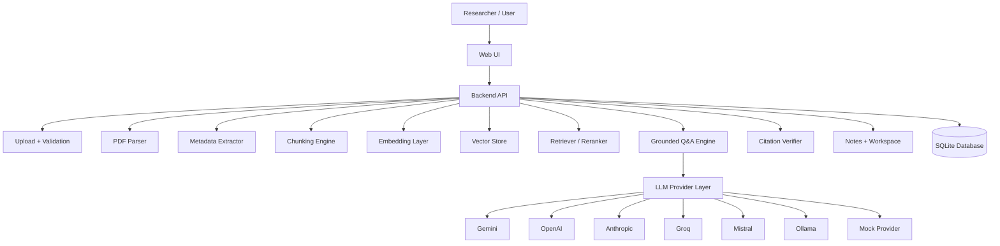

# Research PDF RAG Agent — Architecture Overview

This document describes the design, components, and workflows of the Research PDF RAG Agent.

---

## High-Level System Architecture

The application is structured as a modular full-stack system:



---

## Core Components

### 1. Ingestion Pipeline (`app/core/pdf_loader.py`)
Parses uploaded files page-by-page.
- **Layout Parsing**: Uses `PyMuPDF` to extract structural paragraphs and text blocks.
- **Caption Capture**: Identifies figure and table captions using heuristic prefix matchers.
- **OCR Scan Fallback**: Renders PDF pages to images and runs `pytesseract` OCR on image-heavy/scanned pages.
- **Metadata Extraction**: Performs regex scans on the first page text to guess publication year, authors, title, and document category (e.g. thesis, report, manual).

### 2. Dynamically Filtered Retriever (`app/core/retriever.py`)
Computes semantic and lexical scores for hybrid searching.
- **Incremental Caching**: Generates embeddings using HuggingFace `sentence-transformers/all-MiniLM-L6-v2` and caches them to disk (`embeddings/<doc_id>.npy`) and chunk texts to (`chunks/<doc_id>.json`).
- **Dynamic Compilation**: When searching within a workspace, it loads and concatenates the cached chunk lists and embedding arrays for the selected documents, instantiating a localized BM25 index on the fly.
- **Blended Scoring**: Combines cosine similarity and BM25 scores:
  ```text
  Hybrid Score = 0.62 * Semantic Score + 0.38 * BM25 Score
  ```

### 3. LLM Router (`app/core/llm.py`, `app/core/llm_providers.py`)
Routes generating prompts to the configured service. Supports Gemini SDK, OpenAI chat, Anthropic, Groq, Mistral, Ollama endpoints, and a mock provider that generates grounded briefs citing actual text snippets.

### 4. Citation Verification (`app/core/verifier.py`)
Parses generated answers for inline citation coordinates (e.g. `[filename.pdf p.3]`). Cross-references them against retrieved evidence sources, checks text overlap using Jaccard token formulas, and flags unverified statements.

### 5. Persistence Catalog (`app/core/database.py`)
Maintains a lightweight local SQLite database (`app/storage/research_agent.db`) to record documents, workspaces, notes, query histories, and evaluation logs.
```
                                 +--------------------+
                                 |     workspaces     |
                                 +--------------------+
                                           | 1
                                           |
                                           | *
                             +---------------------------+
                             |    workspace_documents    |
                             +---------------------------+
                                           | *
                                           |
                                           | 1
+--------------------+           +--------------------+           +--------------------+
|       notes        | *-------1 |     documents      | 1-------* |    run_history     |
+--------------------+           +--------------------+           +--------------------+
```
