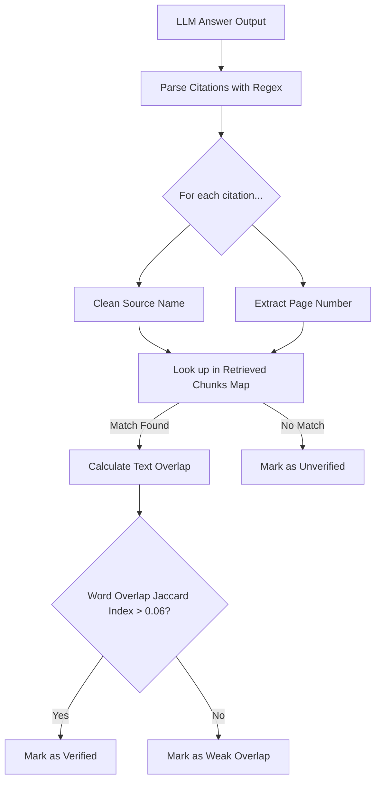

# Research PDF RAG Agent — Citation & Grounding Model

This document explains the citation-grounding model used by the Research PDF RAG Agent to prevent hallucinations and verify claims.

---

## 1. Page-Aware Ingestion Mapping
During PDF ingestion, the text is extracted page-by-page. For each page:
1. The text is parsed, cleaned, and labeled.
2. The page text is chunked using character limits with sentences alignment.
3. Every generated `DocumentChunk` object retains:
   - `doc_id`: Hash identifier of the source file.
   - `source`: File name (e.g. `attention_is_all_you_need.pdf`).
   - `page`: Page index (1-based).
   - `text`: Passage block.

---

## 2. In-Context Citation Constraints
When querying an LLM provider, the system system prompt (`app/core/llm.py`) restricts answering scope:
- The LLM receives retrieved evidence blocks numbered like `[1] Source: attention.pdf, page 3`.
- The instructions command: *"Answer only using the supplied evidence. Every important factual claim must have an inline citation like [filename.pdf p.3]. Do not invent details."*

---

## 3. Verification Algorithm
After the LLM generates the draft answer, the **Citation Verification Layer** (`app/core/verifier.py`) runs:



### 1. Regex Extraction
Citations are extracted using the pattern:
```regex
\[([^\]]+?)\s+(?:p\.?|page)\s*(\d+)\]
```
This catches formats like:
- `[attention_is_all_you_need.pdf p.5]`
- `[attention p. 5]`
- `[attention page 5]`

### 2. Evidence Coordinates Matching
Source file names are cleaned by removing extensions and non-alphanumeric noise. Cleaned citation references are compared against retrieved evidence:
- If a chunk exists from that document on that page, the citation coordinates are verified.
- If not, it is flagged as **Unverified** (meaning the model cited a page or document that was not in the prompt context).

### 3. Text Overlap Validation
To ensure the LLM didn't just dump a correct citation coordinate next to an unsupported claim, the verifier isolates a window of text surrounding the citation in the answer (the claim context) and compares its token intersection against the cited source chunk:
```text
Jaccard Index = Count(Intersection of Claim Words & Chunk Words) / Count(Claim Words)
```
- **High Overlap** ($> 18\%$): Claim words are densely found in the chunk.
- **Medium Overlap** ($6\% - 18\%$): Claim matches key phrases.
- **Low Overlap** ($< 6\%$): Citation coordinates match, but text shows minimal lexical relationship. Flags warnings.

---

## 4. Grounding Metrics & Warnings
The verifier outputs a **Grounding Score**:
$$\text{Grounding Score} = \frac{\text{Verified Citations}}{\text{Total Citations Generated}}$$

Warnings are generated if:
- Grounding score is below $70\%$.
- Model generates citations to unretrieved files/pages.
- No citations are written, but evidence is retrieved.
- Claims have weak text overlaps.
